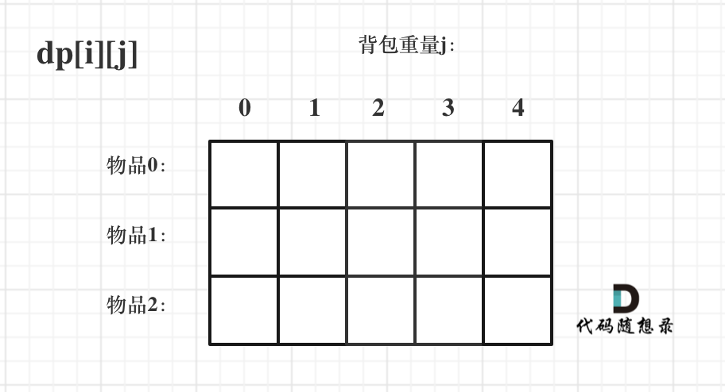
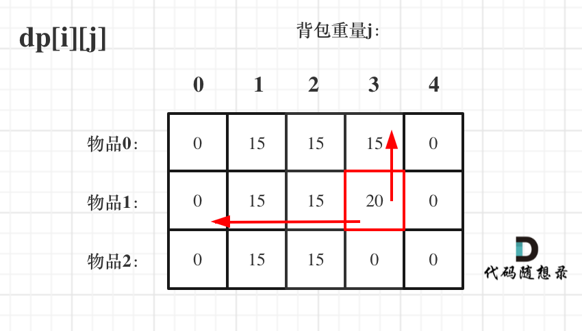
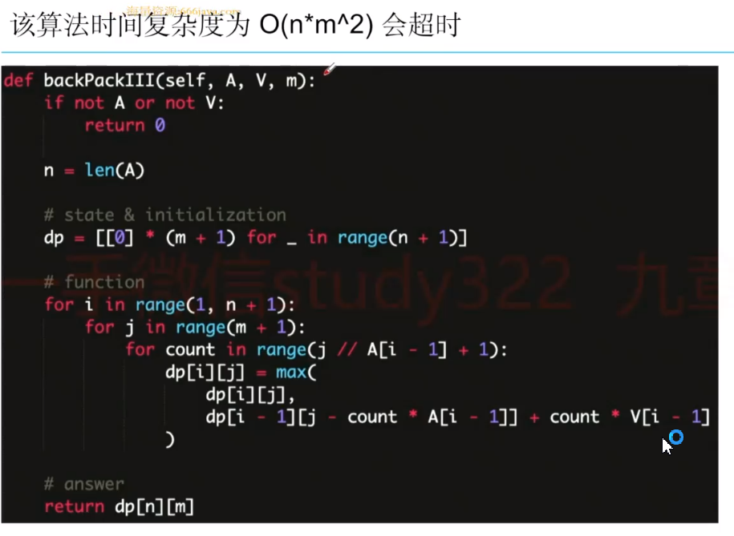
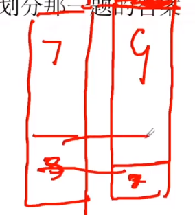

# 背包问题所有分类


# 题目汇总
## leetcode上的背包问题

力扣」上的 0-1 背包问题: 

「力扣」第 416 题: 分割等和子集（中等）；
「力扣」第 474 题: 一和零（中等）；
「力扣」第 494 题: 目标和（中等）；
「力扣」第 879 题: 盈利计划（困难）；
「力扣」上的 完全背包问题: 

「力扣」第 322 题: 零钱兑换（中等）；
「力扣」第 518 题: 零钱兑换 II（中等）；
「力扣」第 1449 题: 数位成本和为目标值的最大数字（困难）. 
这里要注意鉴别: 「力扣」第 377 题, 不是「完全背包」问题. 

## LintCode

[背包问题](https://www.lintcode.com/problem-tag/400/)

# 01背包

## 二维dp

有N件物品和一个最多能背重量为W 的背包. 第i件物品的重量是weight[i], 得到的价值是value[i] . **每件物品只能用一次**, 求解将哪些物品装入背包里物品价值总和最大. 

题目例子: 背包最大重量为4. 物品为: 

|       | 重量 | 价值 |
| ----- | ---- | ---- |
| 物品0 | 1    | 15   |
| 物品1 | 3    | 20   |
| 物品2 | 4    | 30   |

问背包能背的物品最大价值是多少？

---

暴力解法:

每一件物品其实只有两个状态, 取或者不取, 所以可以使用回溯法搜索出所有的情况, 那么时间复杂度就是O(2^n), 这里的n表示物品数量. 

**所以暴力的解法是指数级别的时间复杂度. 进而才需要动态规划的解法来进行优化！**

---

依然动规五部曲分析一波. 

1. 确定dp数组以及下标的含义

使用二维数组, **`dp[i][j]`: 表示从下标为[0-i]的物品里任意取, 放进容量为j的背包, 价值总和最大是多少**. 

下面这个图：



**要时刻记着这个dp数组的含义, 下面的一些步骤都围绕这dp数组的含义进行的**

2. 确定递推公式

`dp[i][j]`的含义：从下标为[0-i]的物品里任意取, 放进容量为j的背包, 价值总和最大是多少. 

那么可以有两个方向推出来`dp[i][j]`, 

* **不放物品i**：由`dp[i - 1][j]`推出, 即背包容量为j, 里面不放物品i的最大价值, 此时`dp[i][j]`就是`dp[i - 1][j]`. (其实就是当物品i的重量大于背包j的重量时, 物品i无法放进背包中, 所以被背包内的价值依然和前面相同. )
* **放物品i**：由`dp[i - 1][j - weight[i]]`推出, `dp[i - 1][j - weight[i]]`为背包容量为j - weight[i]的时候不放物品i的最大价值, 那么`dp[i - 1][j - weight[i]] + value[i]` （物品i的价值）, 就是背包放物品i得到的最大价值

所以递归公式： `dp[i][j] = max(dp[i - 1][j], dp[i - 1][j - weight[i]] + value[i])`

3. dp数组如何初始化

**关于初始化, 一定要和dp数组的定义吻合, 否则到递推公式的时候就会越来越乱**. 

首先从dp[i][j]的定义出发, 如果背包容量j为0的话, 即dp[i][0], 无论是选取哪些物品, 背包价值总和一定为0. 如图：


在看其他情况. 

状态转移方程 `dp[i][j] = max(dp[i - 1][j], dp[i - 1][j - weight[i]] + value[i]);` 可以看出i 是由 i-1 推导出来, 那么i为0的时候就一定要初始化. 

`dp[0][j]`, 即：i为0, 存放编号0的物品的时候, 各个容量的背包所能存放的最大价值. 

那么很明显当 j < weight[0]的时候, `dp[0][j] `应该是 0, 因为背包容量比编号0的物品重量还小. 

当j >= weight[0]时, `dp[0][j]`应该是value[0], 因为背包容量放足够放编号0物品. 

代码初始化如下：

``` 
for (int j = 0 ; j < weight[0]; j++) {  // 当然这一步, 如果把dp数组预先初始化为0了, 这一步就可以省略, 但很多同学应该没有想清楚这一点. 
    dp[0][j] = 0;
}
// 正序遍历
for (int j = weight[0]; j <= bagWeight; j++) {
    dp[0][j] = value[0];
}
```


此时dp数组初始化情况如图所示：


`dp[0][j]` 和 `dp[i][0]` 都已经初始化了, 那么其他下标应该初始化多少呢？

其实从递归公式： `dp[i][j] = max(dp[i - 1][j], dp[i - 1][j - weight[i]] + value[i]); `可以看出`dp[i][j]`是又左上方数值推导出来了, 那么 其他下标初始为什么数值都可以, 因为都会被覆盖. 

**初始-1, 初始-2, 初始100, 都可以！**

但只不过一开始就统一把dp数组统一初始为0, 更方便一些. 

如图：


最后初始化代码如下：

```
// 初始化 dp
vector<vector<int>> dp(weight.size(), vector<int>(bagWeight + 1, 0));
for (int j = weight[0]; j <= bagWeight; j++) {
    dp[0][j] = value[0];
}

```

**费了这么大的功夫, 才把如何初始化讲清楚, 相信不少同学平时初始化dp数组是凭感觉来的, 但有时候感觉是不靠谱的**. 

4. 确定遍历顺序


在如下图中, 可以看出, 有两个遍历的维度：物品与背包重量


那么问题来了, **先遍历 物品还是先遍历背包重量呢？**

**其实都可以！！ 但是先遍历物品更好理解**. 

那么我先给出先遍历物品, 然后遍历背包重量的代码. 

```
// weight数组的大小 就是物品个数
for(int i = 1; i < weight.size(); i++) { // 遍历物品
    for(int j = 0; j <= bagWeight; j++) { // 遍历背包容量
        if (j < weight[i]) dp[i][j] = dp[i - 1][j]; 
        else dp[i][j] = max(dp[i - 1][j], dp[i - 1][j - weight[i]] + value[i]);

    }
}
```

**先遍历背包, 再遍历物品, 也是可以的！（注意我这里使用的二维dp数组）**

例如这样：

```
// weight数组的大小 就是物品个数
for(int j = 0; j <= bagWeight; j++) { // 遍历背包容量
    for(int i = 1; i < weight.size(); i++) { // 遍历物品
        if (j < weight[i]) dp[i][j] = dp[i - 1][j];
        else dp[i][j] = max(dp[i - 1][j], dp[i - 1][j - weight[i]] + value[i]);
    }
}
```

为什么也是可以的呢？

**要理解递归的本质和递推的方向**. 

`dp[i][j] = max(dp[i - 1][j], dp[i - 1][j - weight[i]] + value[i]);` 递归公式中可以看出`dp[i][j]`是靠`dp[i-1][j]`和`dp[i - 1][j - weight[i]]`推导出来的. 

`dp[i-1][j]`和`dp[i - 1][j - weight[i]]`都在`dp[i][j]`的左上角方向（包括正上方向）, 那么先遍历物品, 再遍历背包的过程如图所示：


再来看看先遍历背包, 再遍历物品呢, 如图：



**大家可以看出, 虽然两个for循环遍历的次序不同, 但是dp[i][j]所需要的数据就是左上角, 根本不影响dp[i][j]公式的推导！**

但先遍历物品再遍历背包这个顺序更好理解. 

**其实背包问题里, 两个for循环的先后循序是非常有讲究的, 理解遍历顺序其实比理解推导公式难多了**. 

5. 举例推导dp数组

来看一下对应的dp数组的数值, 如图：


最终结果就是`dp[2][4]`. 

建议大家此时自己在纸上推导一遍, 看看dp数组里每一个数值是不是这样的. 

**做动态规划的题目, 最好的过程就是自己在纸上举一个例子把对应的dp数组的数值推导一下, 然后在动手写代码！**

很多同学做dp题目, 遇到各种问题, 然后凭感觉东改改西改改, 怎么改都不对, 或者稀里糊涂就改过了. 

主要就是自己没有动手推导一下dp数组的演变过程, 如果推导明白了, 代码写出来就算有问题, 只要把dp数组打印出来, 对比一下和自己推导的有什么差异, 很快就可以发现问题了. 

---

Java, dp二维数组的01背包问题: 

```java
package leetcode.dp.bag;

/**
 * https://github.com/youngyangyang04/leetcode-master/blob/master/problems/%E8%83%8C%E5%8C%85%E7%90%86%E8%AE%BA%E5%9F%BA%E7%A1%8001%E8%83%8C%E5%8C%85-1.md
 * <p>
 * dp[i][j]的含义：
 * 从下标为[0-i]的物品里任意取，放进容量为j的背包，价值总和最大是多少。
 * <p>
 * !!! 这里的dp和下文的dp概念不一样
 * <p>
 * 那么可以有两个方向推出来dp[i][v]
 * <p>
 * 1. 不放物品i：由dp[i - 1][v]推出，即背包容量为v，里面不放物品i的最大价值，
 * 此时dp[i][j]就是dp[i - 1][v]。
 * (其实就是当物品i的重量大于背包v的重量时, 物品i无法放进背包中, 所以被背包内的价值依然和前面相同。)
 * <p>
 * <p>
 * 2. 放物品i：由dp[i - 1][v - weight[i]]推出，
 * dp[i - 1][v - weight[i]] 为背包容量为j - weight[i]的时候不放物品i的最大价值，
 * 那么dp[i - 1][v - weight[i]] + value[i](物品i的价值), 就是背包放物品i得到的最大价值
 */
public class Bag01Test {

    public static void main(String[] args) {
        int[] weight = {1, 3, 4};
        int[] value = {15, 20, 30};
        int bagSize = 4;
        testWeightBagProblem(weight.length, weight, value, bagSize);
    }

    public static void testWeightBagProblem(int n, int[] weight, int[] value, int bagSize) {
        // dp[i][v]: dp[i][j]表示背包容量为j时，前i个物品能获得的最大价值
        // 前i个物品: [0,i-1]
        //
        // pat算法笔记中: 前i件物品(1<=i<=n, 0<=v<=V)恰好装入容量为v的背包中所能获得的最大价值

        // 前n个数, [0,n], 开的数组是n+1
        // 这是前缀形题目的注意点
        int[][] dp = new int[n + 1][bagSize + 1];

        // 初始化：背包容量为0时，能获得的价值都为0
        for (int i = 0; i <= n; i++) {
            dp[i][0] = 0;
        }

        // 遍历顺序：先遍历物品，再遍历背包容量
        // 遍历物品, n为物品个数
        for (int i = 1; i <= n; i++) {
            // 遍历背包容量
            for (int v = 1; v <= bagSize; v++) {
                // 其实就是当物品i的重量大于背包v的重量时,
                // 物品i无法放进背包中, 所以被背包内的价值依然和前面相同
                // 第i个数的下标是i-1
                if (weight[i - 1] > v) {
                    dp[i][v] = dp[i - 1][v];
                } else {
                    // 物品i可以放入背包,重量小于背包容量, 看要不要放入
                    dp[i][v] = Math.max(
                        dp[i - 1][v],
                        dp[i - 1][v - weight[i - 1]] + value[i - 1]);
                }
            }
        }
        //打印dp数组
        for (int i = 0; i <= n; i++) {
            for (int j = 0; j <= bagSize; j++) {
                System.out.print(dp[i][j] + " ");
            }
            System.out.print("\n");
        }
    }
}
```


## 滚动数组, 一维dp

一定要注意这里的必须是倒序遍历V

```java
package leetcode.dp.bag;

import java.util.Arrays;

/**
 * 一维dp数组
 * 空间复杂度 O(V)
 */
public class Bag01Test_3 {
    public static void main(String[] args) {
        int[] weight = {1, 3, 4};
        int[] value = {15, 20, 30};
        int V = 4;
        testWeightBagProblem3(weight.length, weight, value, V);
    }

    /**
     * dp[j]表示背包容量为j时，能获得的最大价值
     */
    private static void testWeightBagProblem3(int n, int[] weight, int[] value, int V) {
        // 定义dp数组：dp[j]表示背包容量为j时，能获得的最大价值
        int[] dp = new int[V + 1];

        //遍历顺序：先遍历物品，再遍历背包容量
        // [0, n), weight和value就是第i个
        for (int i = 0; i < n; i++) {
            for (int v = V; v >= weight[i]; v--) {
                // 此时dp[j]有两个选择，
                // 1.取自己dp[j] 相当于 二维dp数组中的dp[i-1][j]，即不放物品i，
                // 2.取dp[j - weight[i]] + value[i]，即放物品i，
                dp[v] = Math.max(dp[v], dp[v - weight[i]] + value[i]);
            }

            // 打印dp数组
            System.out.println(i + ":" + Arrays.toString(dp));
        }
    }
}
```

---

## 什么是01背包

问题描述: 给出n个物品及其大小`weight[i]`, 问是否可以挑选一些物品装满大小为m(bagSize)的背包, 尽可能接近m(bagSize), 不超过(<=)

或者再给每个物体的价值`value[i]`, 问可以获得的最大价值是多少

---

例子: [2, 3, 5, 7] -> m = 11. 可以[2,3,5]凑10. 或者[3,7]凑10.

[2,3,5,7] -> m=12. 可以[5,7]凑12

---

问法:

* 能不能装满, true/false
* 尽可能装满. -> value[i]最大的价值, 最优的问题

dp解决问题的类型: 最大值; 可行性; 方案数. dp一定属于这三种

---

01背包: 

每个物品要么挑0个（不）要么挑1个，所以叫01

如果一个物品可以被分割，就不是01背包. -> 贪心

如果一个物品可以选多份，就叫多重背包

## 背包问题的状态表示

`dp[i][j]`: **前i个**物品里挑出若干物品组成**和为j**的大小是否可行

两个关键点：前&和

* 前i个: 前缀. 位置信息 
  * -> ***注意这里的前i个数, 注意第i个数的下标是i-1***. 前n个数有n+1个数字
  * 务必注意**前缀**. 有前0个数的存在.

* 和为j: 和的信息

题目: 

[问题](https://www.lintcode.com/problem/backpack), [解答](https://www.jiuzhang.coin/solutions/backpack)

两种状态表示:

* `dp[i][j]`表示前i个数里是否能凑出j的和,true/false
* `dp[i][j]`表示前i个数能否凑出的<=j的最大和是多少

---

ps: 数组是否需要进行排序?

不需要, 与A数组大小顺序无关

### 第一种表示, boolean

ps: A[i]就是weight[i]

* 状态 state
  * `dp[i][j]`表示前i个数里挑若干个数是否能组成和为j
* 方程function:
  * `dp[i][j] = dp[i-1][j] or dp[i-1][j-A[i]] 如果j >= A[i]`
  * `dp[i][j] = dp[i-1][j] 如果j < A[i]`

* base case:
  * `dp[0][0] = true` -> 前0个数凑出来重量为0. 直接就是true
  * `dp[0][1...m] = false` -> 前0个数凑出来重量为m. 肯定凑不出来, false

* return
  * 使得`dp[n][v]`, 0<=v<=m为true的最大v. 倒过来遍历`dp[n][v]`, 第一个为true的就是能凑出的最大和

---

`dp[i][j]`: 前i个数里挑若干个数能否组成j. 看第i个数(下标i-1)要不要拿了放到背包中. 

* 如果前i-1个数可以组成和j, 那么第i个数就可以不要了. -> `dp[i][j] = dp[i-1][j]`
* 否则的话, 就看前i-1个数能不能凑出来j-A[i]的数字和. 如果可以的话, 那么就前i - 1个数凑j-A[i], 第i个数凑A[i]. 前提是j要比A[i]大, 就是要凑的数字(重量)大于第i个物品的数量

* 如果第i个物品的重量A[i]都大于要凑的重量j了, 那么就不能放入第i个物品. `dp[i][j] = dp[i-1][j]` -> 一般先判断此条件

```java
// 第i个物品的重量大于要凑的重量和j, 那么就不放入第i个物品 -> dp[i][j] = dp[i-1][j]
// 务必注意: 第i个物品下标是i-1
if (weight[i - 1] > j) {
    dp[i][j] = dp[i - 1][j];
} else {
    // dp[i][j]: 前i个物品挑若干个能否凑成数字j
    // 第i个物品凑不凑的成有两种情况:
    // 要么是前i-1个物品已经凑成了, 不需要第i个物品
    // 要么是前i-1个物品凑成了j-weight[i-1], 再加上第i个物品的weight[i-1]正好凑成
    dp[i][j] = dp[i - 1][j] || dp[i - 1][j - weight[i - 1]];
}
```

完整代码

```java
/**
 * 最多可以装多满
 * -> 能否凑成bagSize, boolean, 然后找可以凑成的最大v
 *
 */
public class Bag01Test1 {

    public static void main(String[] args) {
        int[] weight = {1, 3, 4};
        // int[] value = {15, 20, 30};
        int bagSize = 11;
        System.out.println(testWeightBagProblem(weight, bagSize));
    }

    public static int testWeightBagProblem(int[] weight, int bagSize) {
        int n = weight.length;

        boolean[][] dp = new boolean[n + 1][bagSize + 1];

        // ------------------------ initial ------------------------
        // 前0个数字凑数字0, 为true. 其他的初始化为false
        dp[0][0] = true;

        // ------------------------ handle ------------------------
        // 先遍历数字再遍历容量
        // 因为有i-1, 从i==1开始遍历
        for (int i = 1; i <= n; i++) {
            for (int j = 0; j <= bagSize; j++) {
                // 第i个物品的重量大于要凑的重量和j, 那么就不放入第i个物品 -> dp[i][j] = dp[i-1][j]
                // 第i个物品下标是i-1
                if (weight[i - 1] > j) {
                    dp[i][j] = dp[i - 1][j];
                } else {
                    // dp[i][j]: 前i个物品挑若干个能否凑成数字j
                    // 第i个物品凑不凑的成有两种情况:
                    // 要么是前i-1个物品已经凑成了, 不需要第i个物品
                    // 要么是前i-1个物品凑成了j-weight[i-1], 再加上第i个物品的weight[i-1]正好凑成
                    dp[i][j] = dp[i - 1][j] || dp[i - 1][j - weight[i - 1]];
                }
            }
        }

        // ------------------------ output ------------------------
        for (int v = bagSize; v >= 0; v--) {
            if (dp[n][v]) {
                return v;
            }
        }
        return -1;
    }
}
```

### 第二种表示, 能凑出的最大和

* 状态, state:

`dp[i][j]`: 前i个数中挑出若干个数总和<=j的最大和是多少

* 方程, function: 
  * `dp[i][j] = max(dp[i-1][j], dp[i-1][j-A[i-1]] + A[i-1])`, 如果j >= A[i-1]. 第i个数字可以放入也可以不放入, 容量j都够. 如果不放入的话, 那么就由前i-1个数字凑容量j. 如果放入的话, 那么前i-1个数字负责凑`j-A[i-1]`的容量, 由第i个数字凑A[i-1]的重量(也就是他本身)
  * `dp[i][j] = dp[i-1][j]`, 如果j < A[i-1]. 第i个数字本身重量已经超过容量j了, 放不进去
  * 务必注意: 前缀, 前i个数. 第i个数的小标是i-1

* base case

`dp[0][0..bagSize] = 0`

* return

`dp[n][bagSize]`

---

这种写法在答案的return和base case更加简洁

这种写法比第一种效率低, 因为||或运算比加法运算要快.

---

代码

```java
public int backPack(int m, int[] A) {
    // write your code here
    int n = A.length;

    int[][] dp = new int[n+1][m+1];

    for (int i = 1; i <= n; i++) {
        for (int j = 0; j <= m; j++) {
            if (j < A[i-1]) {
                dp[i][j] = dp[i-1][j];
            } else {
                dp[i][j] = Math.max(dp[i-1][j], dp[i-1][j-A[i-1]] + A[i-1]);
            }
        }
    }

    return dp[n][m];
}
```


## 背包问题: dp和搜索

使用组合型深度优先搜索, 时间复杂度: O(n*2^n). -> 之前的ksum的问题, 这里就是nsum. 每个数有选中和未选中两个情况

动态规划的时问复杂度是O(n*m)

动态规划是否一定更好?

不一定, 考虑极端情况: [1,2,4,8,16], m=31, 数组就是2的次方

这种极端情况, 0~31的所有和都可以被凑出来, 时间复杂度`O(n*m) = O(n*2^n)`

另外一个极端情况: [1, 1000, 1000000], m = 1001001. 多种方式凑出同一个和的时候dp更慢?

m>>2^n, 搜索的方法反而更快. dp的for循环从0开始到m

大部分的dp都比搜索快, 但是背包的dp不一定, 取决于m的大小和数据. m小的时候, dp快

---

背包问题的重复子问题是什么？

[1,2,3,4,5,6,7,8,9,10000]

比如要凑出和为10010

前10个数里组合出和为10的方法有5种, 这5种组合方式就是重复子问题，因为他们凑出来的和都是10, 对于后面+10000之后组成10010的影响是一样的

我们不关心10是怎么凑的，只关心10能不能被凑出来. 在判断10000这层判断的时候, 不需要再计算前面的了, 优化了凑10的这个子问题. 

如果用搜索的方法的话, 那么对于所有的10, 都要进行搜索

## 带价值的01背包

[问题](https://www.lintcode.com/problem/125/?_from=problem_tag&fromId=undefined)

有 `n` 个物品和一个大小为 `m` 的背包. 给定数组 `A` 表示每个物品的大小和数组 `V` 表示每个物品的价值.

问最多能装入背包的总价值是多大?

可以将原来的没有价值的01背包理解成体积和价值是同等大小的

A = [2,3,5,6], V = [1,5,2,4]. m = 10

---

* state

`dp[i][j]`: 表示前i个物品挑出一些放到j的背包里的最大价值和

* function

如果i无法翻入背包(太重了, j > A[i-1]): `dp[i][j] = dp[i-1][j]`

如果i可以放入背包: `dp[i][j] = max(dp[i-1][j], dp[i-1][j-A[i-1]] + value[i-1])`

第i个的重量可以放入背包, 那么就看放入第i个和不放入第i个的价值哪个大, 如果不让入第i个就是`dp[i-1][j]`. 如果放入第i个, 那么在前i-1个负责j-A[i-1]的重量可以取到的最大价值, 再加上第i个的价值. 两者看最大

* base case

`dp[0][0...m] = 0`

* return

`dp[n][m]`

---

题目解答:

```java

public class Solution {
    /**
     * @param m: An integer m denotes the size of a backpack
     * @param A: Given n items with size A[i]
     * @param V: Given n items with value V[i]
     * @return: The maximum value
     */
    public int backPackII(int m, int[] A, int[] V) {
        // write your code here
        int n = A.length;

        int[][] dp = new int[n+1][m+1];

        Arrays.fill(dp[0], 0);

        for(int i = 0; i <= n; i++) {
            dp[i][0] = 0;
        }

        for (int i = 1; i <= n; i++) {
            for (int j = 1; j <= m; j++) {
                if (A[i-1] > j) {
                    dp[i][j] = dp[i-1][j];
                } else {
                    dp[i][j] = Math.max(dp[i-1][j], dp[i-1][j-A[i-1]] + V[i-1]);
                }
            }
        }

        return dp[n][m];


    }
}
```


# 完全背包

[背包问题3](https://www.lintcode.com/problem/440/?_from=problem_tag&fromId=undefined). **物品有无限个**

给定 `n` 种物品, 每种物品都有无限个. 第 `i` 个物品的体积为 `A[i]`, 价值为 `V[i]`.

再给定一个容量为 `m` 的背包. 问可以装入背包的最大价值是多少?

A = [2,3,5,6], V = [1,5,2,4]. m = 10

---

## 超时算法

* state

`dp[i][j]`: 表示前i个物品挑出一些放到j的背包里的最大价值和

* function

`dp[i][j] = max(dp[i-1][j-count*A[i-1]] + count*V[i-1])`, 其中`0 <= count <= (j/A[i-1])`, 遍历所有的可能性

这里可以结合01背包的状态转移来理解, 将count加上之前的dp转移中:

01背包: `dp[i][j] = max(dp[i-1][j - 0*A[i-1]] + 0*value[i-1], dp[i-1][j-1*A[i-1]] + 1*value[i-1])`

* base case:

`dp[0][0...m]`

* return

`dp[n][m]`




## 优化

count这个决策层中有重复的计算. i,j是状态层循环. 希望可以少一些count的遍历

在状态转移方程中, 我们将式子展开来看一下:

```java
dp[i][j] = max(
    dp[i-1][j], 
    dp[i-1][j-A[i-1]*1] + V[i-1], 
    dp[i-1][j-A[i-1]*2] + V[i-1]*2,
    ...);
```

简化之后:

`dp[i][j] = max(dp[i-1][j], dp[i][j-A[i-1]] + V[i-1])`

注意这里的第二项是dp[i]开始的


---

其实还可以这么理解:

放入第i个物品的时候, 01背包因为每个物品只能选择一个, 所以放入第i个物品就意味着必须转移到`dp[i-1][j-A[j]]`. 但是完全背包不是, 他是转移到`dp[i][j-A[i]]`, 因为每件物品都可以放任意件(注意有容量限制, 因此还是有限的), 放了第i个物品之后还可以继续放第i个物品, 知道第二维度的j-A[i]无法保持大于等于0为止

所以和01背包的唯一区别就是在于第二个参数是dp[i]开始, 不是dp[i-1]


---

题解:

唯一的变化就是

从: `dp[i][j] = Math.max(dp[i-1][j], dp[i-1][j-A[i-1]] + V[i-1]);`

到: `dp[i][j] = Math.max(dp[i-1][j], dp[i][j-A[i-1]] + V[i-1]);`

```java
public class Solution {
    /**
     * @param A: an integer array
     * @param V: an integer array
     * @param m: An integer
     * @return: an array
     */
    public int backPackIII(int[] A, int[] V, int m) {
        // write your code here
         int n = A.length;

        int[][] dp = new int[n+1][m+1];

        Arrays.fill(dp[0], 0);

        for(int i = 0; i <= n; i++) {
            dp[i][0] = 0;
        }

        for (int i = 1; i <= n; i++) {
            for (int j = 1; j <= m; j++) {
                if (A[i-1] > j) {
                    dp[i][j] = dp[i-1][j];
                } else {
                    dp[i][j] = Math.max(dp[i-1][j], dp[i][j-A[i-1]] + V[i-1]);
                }
            }
        }

        return dp[n][m];

    }
}
```


通常是二维的状态数组，前i个组成和为j

状态数组的大小需要开(n+1)*(m+1)

题目中通常有"和"与"差"的概念, 数值会被放到状态中

每个数存在**选或者不选**两种状态(01背包)

每个数可以选任意多个(多重背包)

数的顺序无关

# 多重背包


# 题目

## 背包问题

[背包问题](https://www.lintcode.com/problem/92/description?_from=problem_tag&fromId=undefined)

在`n`个物品中挑选若干物品装入背包，最多能装多满？假设背包的大小为`m`，每个物品的大小为A[i]

01背包, 问能凑出的最大数是多少

### 解法1, boolean

`dp[i][j]`: 前i个数字能否凑出和为j?.

输出的时候, 倒过来遍历`dp[n][m]`, 找到第一个为true的v, 那么就是能凑出的最大的数字了.

```java
public class Solution {
    /**
     * @param m: An integer m denotes the size of a backpack
     * @param A: Given n items with size A[i]
     * @return: The maximum size
     */
    public int backPack(int m, int[] A) {
        // write your code here
        int n = A.length;

        boolean[][] dp = new boolean[n+1][m+1];
        // base case
        dp[0][0] = true;

        // dp
        for (int i = 1; i <= n; i++) {
            for (int j = 0; j <= m; j++) {
                if (j < A[i-1]) {
                    dp[i][j] = dp[i-1][j];
                } else {
                    dp[i][j] = dp[i-1][j] || dp[i-1][j-A[i-1]];
                }
            }
        }

        for (int v = m; v >= 0; v--) {
            if (dp[n][v]) {
                return v;
            }
        }

        return -1;
    }
}
```

### 解法2, 能凑的最大值

```java
public class Solution {
    /**
     * @param m: An integer m denotes the size of a backpack
     * @param A: Given n items with size A[i]
     * @return: The maximum size
     */
    public int backPack(int m, int[] A) {
        // write your code here
        int n = A.length;

        int[][] dp = new int[n+1][m+1];

        for (int i = 1; i <= n; i++) {
            for (int j = 0; j <= m; j++) {
                if (j < A[i-1]) {
                    dp[i][j] = dp[i-1][j];
                } else {
                    dp[i][j] = Math.max(dp[i-1][j], dp[i-1][j-A[i-1]] + A[i-1]);
                }
            }
        }

        return dp[n][m];
    }
}
```


## 最小划分

[google真题](https://www.lintcode.com/problem/724/)

给出一个正整数数组，写一个程序把这个整数数组分成S1跟S2两部分，使S1中的和跟S2中的和的差的绝对值最小。换句话讲，如果有一个一个整数数组 `S` 有 `n` 个数，如果Subset1有 `m` 个数，Subset2必须有 `n-m` 个数并且 `abs(sum(Subset1) – sum(Subset2))` 应该最小

```
x与sum-x之间的差距尽可能小. |sum-x-x| = |sum - 2x|
题意转换为 -> s1中的和x尽可能接近sum / 2 -> 数组中挑选若干个数, 和尽可能接近sum / 2
```

两个子部分要尽量接近, 也就是接近sum / 2的最大值是多少 

-> 背包问题, 前i个元素可以凑到的最大元素和<= sum/2的

```java
public class Solution {
    /**
     * @param nums: the given array
     * @return: the minimum difference between their sums 
     */
    public int findMin(int[] nums) {
        // write your code here
        // write your code here
        int n = nums.length;
        int sum = 0;

        for (int i = 0; i <n; i++) {
            sum+=nums[i];
        }


        int V = sum / 2;
        int[][] dp = new int[n + 1][V + 1];

        for (int i = 1; i <= n; i++) {
            for (int v = 1; v <= V; v++) {
                if (v < nums[i - 1]) {
                    dp[i][v] = dp[i - 1][v];
                } else {
                    dp[i][v] = Math.max(
                        dp[i - 1][v],
                        dp[i - 1][v - nums[i - 1]] + nums[i - 1]);
                }
            }
        }

        // dp: 前i个数字, 能凑到的最大的元素和
        int halfMax = 0;
        for (int v = 0; v <= V; v++) {
            if (dp[n][v] > halfMax) {
                halfMax = dp[n][v];
            }
        }

        return Math.abs((sum - halfMax) - halfMax);
    }
}
```


## 外卖券
[外卖券美团](https://www.nowcoder.com/questionTerminal/95329d9a55b94e3fb2da475d3d052164)

你有一张满X元减10元的满减券和每个菜品的价格（整数）, 每个菜最多只买一份. 问最少买多少钱可以用得上这张外卖券？  

挑选若干数之和>=X且和最小 ->  挑选出一些“不加入购物车”的菜品, 尽可能填满一个SUM-X的背包

大于等于x的最小值 -> 小于等于sum-x的最大值 -> 背包问题

又变成了01背包类题目

```java
package leetcode.dp.bag;

import java.util.Arrays;
import java.util.Scanner;

/**ac
 * https://www.nowcoder.com/questionTerminal/95329d9a55b94e3fb2da475d3d052164
 * <p>
 * 链接：https://www.nowcoder.com/questionTerminal/95329d9a55b94e3fb2da475d3d052164
 * 来源：牛客网
 * <p>
 * 你打开了美了么外卖，选择了一家店，你手里有一张满 X 元减 10 元的券，
 * 店里总共有 n 种菜，第 i 种菜一份需要 Ai 元，因为你不想吃太多份同一种菜，所以每种菜你最多只能点一份，
 * 现在问你最少需要选择多少元的商品才能使用这张券。
 * <p>
 * 1<=n,Ai<=100, 1<=X<=10000
 * <p>
 * input:
 * 第一行两个正整数n和X，分别表示菜品数量和券的最低使用价格。
 * 接下来一行n个整数，第i个整数表示第i种菜品的价格。
 * <p>
 * output:
 * 一个数，表示最少需要选择多少元的菜才能使用这张满X元减10元的券，保证有解。
 * <p>
 * 5 20
 * 18 19 17 6 7
 * <p>
 * -> 23
 * <p>
 * 只能选一个, 01背包问题
 * 最少需要选择多少元的商品才能使用这张券。
 * <p>
 * 要求>=X的最小值
 * 之前的01背包是<=X的最大值
 * 这里做一个转换即可
 * 求剩下的菜, <=sum-X的最大值
 */
public class TakeOutCoupon_meituan {
    public static void main(String[] args) {
        // 二维dp
        // solution1();

        // 一维dp
        Scanner sc = new Scanner(System.in);
        int n = sc.nextInt();
        int X = sc.nextInt();
        int[] nums = new int[n];
        int sum = 0;
        for (int i = 0; i < n; i++) {
            nums[i] = sc.nextInt();
            sum += nums[i];
        }

        int V = sum - X;

        int[] dp = new int[V + 1];
        dp[0] = 0;
        for (int i = 0; i < n; i++) {
            // 01背包, 一维务必倒序
            for (int v = V; v >= nums[i]; v--) {
                dp[v] = Math.max(dp[v], dp[v - nums[i]] + nums[i]);
            }
        }
        System.out.println(sum - dp[V]);

    }

    /**
     * 二维dp
     */
    private static void solution1() {
        Scanner sc = new Scanner(System.in);
        int n = sc.nextInt();
        int X = sc.nextInt();
        int[] nums = new int[n];
        int sum = 0;
        for (int i = 0; i < n; i++) {
            nums[i] = sc.nextInt();
            sum += nums[i];
        }

        int V = sum - X;

        // 前i个物品恰好凑成V的最大价值
        // dp[n][v]: 前n个物品, 重量为v的最大价值
        int[][] dp = new int[n + 1][V + 1];

        // base case
        // dp[0][...]
        Arrays.fill(dp[0], 0);
        // dp[...][0]
        for (int i = 0; i <= n; i++) {
            dp[i][0] = 0;
        }

        for (int i = 1; i <= n; i++) {
            for (int v = 1; v <= V; v++) {
                if (nums[i - 1] > v) {
                    dp[i][v] = dp[i - 1][v];
                } else {
                    dp[i][v] = Math.max(
                        dp[i - 1][v],
                        dp[i - 1][v - nums[i - 1]] + nums[i - 1]);
                }
            }
        }
        System.out.println(sum - dp[n][V]);
    }
}

```

## 石头碰撞
给出N个石头及其大小数组, 每次选2个石头进行碰撞, 大小分别为x,y 

碰撞之后会变成一个石头, 大小变为|x-y|

直到石头个数<2为止, 问最后剩下来的石头最小是多少？

---

本质上就是最小划分的题目

例子: [3, 7, 2, 9] . 最小的话是1, 也就是分成两堆, 然后两堆的和尽量一致, 求最小的差



a和b, 碰撞后变成了b-a, 新的石头


## 带价值的背包问题

[背包问题2](https://www.lintcode.com/problem/125/?_from=problem_tag&fromId=undefined)

有 `n` 个物品和一个大小为 `m` 的背包. 给定数组 `A` 表示每个物品的大小和数组 `V` 表示每个物品的价值.

问最多能装入背包的总价值是多大?


```java

public class Solution {
    /**
     * @param m: An integer m denotes the size of a backpack
     * @param A: Given n items with size A[i]
     * @param V: Given n items with value V[i]
     * @return: The maximum value
     */
    public int backPackII(int m, int[] A, int[] V) {
        // write your code here
        int n = A.length;

        int[][] dp = new int[n+1][m+1];

        Arrays.fill(dp[0], 0);

        for(int i = 0; i <= n; i++) {
            dp[i][0] = 0;
        }

        for (int i = 1; i <= n; i++) {
            for (int j = 1; j <= m; j++) {
                if (A[i-1] > j) {
                    dp[i][j] = dp[i-1][j];
                } else {
                    dp[i][j] = Math.max(dp[i-1][j], dp[i-1][j-A[i-1]] + V[i-1]);
                }
            }
        }

        return dp[n][m];


    }
}
```


# Ref

1. 作者: liweiwei1419
   链接: https://leetcode-cn.com/problems/partition-equal-subset-sum/solution/0-1-bei-bao-wen-ti-xiang-jie-zhen-dui-ben-ti-de-yo/
   来源: 力扣（LeetCode）
   著作权归作者所有. 商业转载请联系作者获得授权, 非商业转载请注明出处. 

2. [背包理论基础01背包-1.](https://github.com/youngyangyang04/leetcode-master/blob/master/problems/%E8%83%8C%E5%8C%85%E7%90%86%E8%AE%BA%E5%9F%BA%E7%A1%8001%E8%83%8C%E5%8C%85-1.md#%E4%BA%8C%E7%BB%B4dp%E6%95%B0%E7%BB%8401%E8%83%8C%E5%8C%85)

3. [背包理论基础01背包-2.md](https://github.com/youngyangyang04/leetcode-master/blob/master/problems/%E8%83%8C%E5%8C%85%E7%90%86%E8%AE%BA%E5%9F%BA%E7%A1%8001%E8%83%8C%E5%8C%85-2.md)

4. [背包问题理论基础完全背包.md](https://github.com/youngyangyang04/leetcode-master/blob/master/problems/%E8%83%8C%E5%8C%85%E9%97%AE%E9%A2%98%E7%90%86%E8%AE%BA%E5%9F%BA%E7%A1%80%E5%AE%8C%E5%85%A8%E8%83%8C%E5%8C%85.md)
5. [背包问题理论基础多重背包.md](https://github.com/youngyangyang04/leetcode-master/blob/master/problems/%E8%83%8C%E5%8C%85%E9%97%AE%E9%A2%98%E7%90%86%E8%AE%BA%E5%9F%BA%E7%A1%80%E5%A4%9A%E9%87%8D%E8%83%8C%E5%8C%85.md)

6. [背包总结篇.md](https://github.com/youngyangyang04/leetcode-master/blob/master/problems/%E8%83%8C%E5%8C%85%E6%80%BB%E7%BB%93%E7%AF%87.md)


